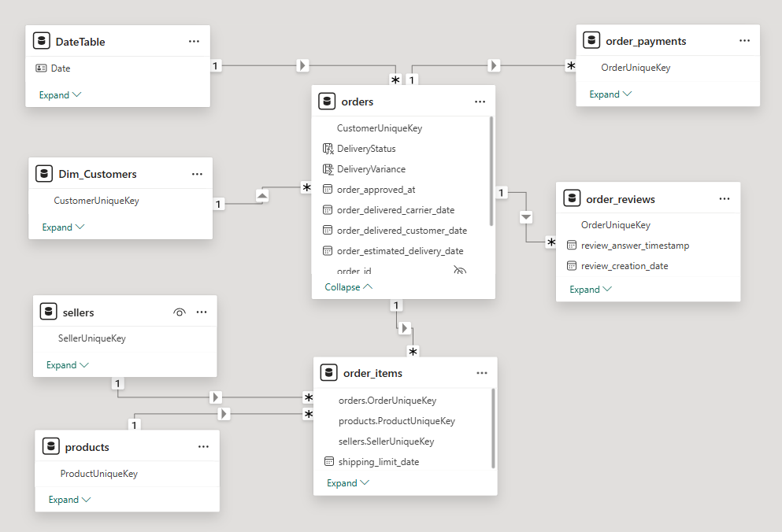

# 🛒 Olist E-Commerce Power BI Dashboard

- An interactive Power BI dashboard built on the **Brazilian E-Commerce Public Dataset by Olist** from Kaggle.
- The report provides a full business overview across sales, customers, products, and operations — covering data from **2016 to 2018**.

---

## 📁 Data Source

- **Dataset:** [Brazilian E-Commerce Public Dataset by Olist](https://www.kaggle.com/datasets/olistbr/brazilian-ecommerce)
- **Platform:** Kaggle
- **Period:** 2016 – 2018

---

## 🗄️ Data Model

- The project follows **Multi-Fact Star Schema (Galaxy Schema)**
- This design handles multiple business processes (Orders, Payments, and Reviews) while sharing common  
dimensions like Date, Customers, and Products, which ensures Data Consistency across all reports
   - optimized query performance
   - Time Intelligence
   - DAX calculations

******

---

### Tables

| Table | Key Column | Description |
|-------|-----------|-------------|
| `orders` | `OrderUniqueKey` | Central fact table with order status and dates |
| `Dim_Customers` | `CustomerUniqueKey` | Customer location and identity |
| `products` | `ProductUniqueKey` | Product details and dimensions |
| `sellers` | `SellerUniqueKey` | Seller identity |
| `order_items` | — | Line items linking orders, products, sellers |
| `order_payments` | `OrderUniqueKey` | Payment type and value |
| `order_reviews` | `OrderUniqueKey` | Review scores and timestamps |
| `DateTable` | `Date` | Custom date dimension |

---

## 🧹 Part of Data Cleaning

Performed in **Power Query** before loading to the model:

1. **Custom Surrogate Keys** — Original ID columns used long hexadecimal strings (e.g., `e481f51cbdc54678b7cc49136f2d6af7`). A clean integer index key was created for each main table and used for all relationships:
   - `CustomerUniqueKey` (customers)
   - `SellerUniqueKey` (sellers)
   - `ProductUniqueKey` (products)
   - `OrderUniqueKey` (orders)

2. **Removed Duplicates** — Duplicate rows were removed from all tables.

3. **orders table** — Merged with `Dim_Customers` using the new `CustomerUniqueKey`; original hex customer ID was dropped.

---

## 📐 DAX Measures

Measures are organized into folders inside the `_Measures` table:

| Folder | Measures |
|--------|---------|
| **Items** | Actual Orders, Avg Shipping, AvgProductPrice, Items Sold, Net Product Sales|
|**Items** |  Sales Unknown Product,  Shipping %,  Shipping Revenue,  Total Revenue |
| **Orders** | AvgDeliveryDays, AvgDeliveryVariance, OTD%, Total Customers , Total Orders |
| **Payments** | AOV, Revenue QTD, Total Transactions |
| **Problems** | EmptyProductName, Gap (Transactions vs SoldItems), Unknown Ordered Products, Unknown Revenue |
| **Products** | Total Categories, Total Products |
| **Reviews** | AvgReviewScore, Total Reviews |

---

## 📊 Dashboard

### 1. Overview
******

---

### 2. Customers
******

---

### 3. Products
******
<!--  -->

---

### 4. Operations
******

---

## 🔍 Project Insights

- **São Paulo dominates** all metrics — it leads in both revenue ($2.17M) and customer count (14,971), making it the single most important market by a wide margin.
- **Revenue peaked in mid-2018 (Q2)** then dropped sharply in Q3, likely due to incomplete data at the end of the dataset period rather than an actual business decline.
- **Health & Beauty is the #1 category** by revenue ($1.44M), followed by Watches & Gifts and Bed/Bath/Table — lifestyle and personal care products drive the most sales.
- **Credit card is the dominant payment method** at 75.1%, with Boleto (a Brazilian payment slip) as a distant second at 19.55% — reflecting typical Brazilian e-commerce behavior.
- **On-Time Delivery is strong at 93%**, and the average delivery variance is -12 days, meaning orders are generally arriving earlier than the estimated date.
- **Shipping accounts for 14% of total transactions** with an average cost of $20, generating $2.25M in shipping revenue.
- **Data quality issues exist** — $213K in revenue cannot be attributed to a known product, 1,627 ordered products are unidentified, and 623 product names are empty, which is worth addressing in future data pipelines.
- **Average review score is 4.09 / 5.00** across 99,224 reviews, indicating a generally satisfied customer base.

---

## 💡 Final Conclusion

The Olist platform shows strong and consistent growth from 2016 through mid-2018, with revenue reaching **$15.84M** across **98,666 orders**. The business is heavily concentrated in Brazil's major southeastern cities, particularly São Paulo and Rio de Janeiro, which together account for a significant share of both customers and revenue.

Operationally, the platform performs well — delivery is reliable and customer satisfaction is high. However, the gap between total transactions ($16.01M) and recognized product revenue ($15.84M), along with a notable volume of unattributed orders, suggests room for improvement in data completeness and product catalog management.

Overall, Olist demonstrates a scalable e-commerce model with clear geographic and category strengths to build on.

---

## 🎯 Key Takeaways for Business

| # | Takeaway |
|---|----------|
| 1 | **Double down on São Paulo & Rio** — they generate the lion's share of revenue; targeted campaigns here will have the highest ROI. |
| 2 | **Invest in Health & Beauty and Watches** — these are the top-performing categories and should be prioritized for inventory and promotions. |
| 3 | **Leverage the strong OTD rate (93%)** as a marketing differentiator — fast and reliable delivery is a competitive advantage. |
| 4 | **Fix data attribution gaps** — $213K in unknown revenue and 1,627 unidentified products represent both a reporting risk and potential lost insights. |
| 5 | **Expand Boleto & digital payment options** — while credit card dominates, offering more payment flexibility could unlock customers without credit access. |
| 6 | **Monitor Q3 2018 drop** — investigate whether the revenue decline is a data truncation issue or an early signal of market slowdown. |

---

## 🛠️ Tools Used

- **Power BI Desktop** — Report building, DAX, Power Query
- **Power Query (M)** — Data cleaning and transformation
- **DAX** — Measures and calculated columns
- **Figma** — Designing Dashboard

---

## 🚀 How to Use

1. Download the dataset from [Kaggle](https://www.kaggle.com/datasets/olistbr/brazilian-ecommerce).
2. Open the `.pbix` file in **Power BI Desktop**.
3. Update the data source path to point to your local CSV files.
